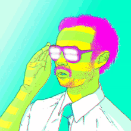

### 👱Hi there, I'm Abhisek Ray💼 

##
- 🔭 I am currently learning iOS development⚡
- 💻 I’m a computer science Geek⚡
- 🥅 2021 Goals: Contribute more to Open Source projects and develop some more skills.⚡

 
 

---

  

    
  

